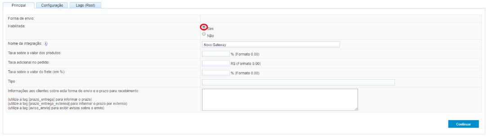
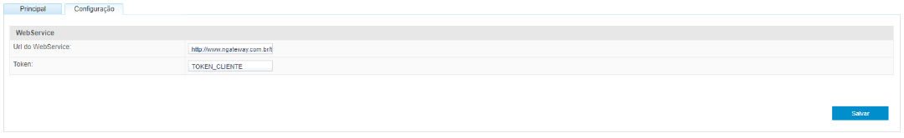

# API de Integração de Frete

## Integração de Frete

Atualmente disponibilizamos duas formas para integração de frete.


Integração Gateway de Frete | Descrição
----------------------------|----------
Objetivo	|Disponibilizar cotações de frete ao lojista, conforme disponibilidade de envio do integrador
Documentação	|[https://traydevelopers.zendesk.com/hc/pt-br/articles/360017423314-Gateway-de-Frete](https://traydevelopers.zendesk.com/hc/pt-br/articles/360017423314-Gateway-de-Frete)
Funcionalidade	|"A integração via Gateway de Frete, não é necessário um aplicativo para disponibilizar as cotações. Conforme a documentação, você precisará apenas disponibilizar uma url para integrar com a loja do cliente. A informação da url e o token, são disponibilizado no painel administrativo da loja, dessa forma, para efetuar o cadastro da url do Gateway de Frete, o integrador deverá informar o lojista para que o mesmo efetue a configuração da url e o token dentro da loja para integração do Gateway de Frete, lembrando que o token deverá ser fornecido por loja que integrar e o mesmo deverá ser fixo. Esse token do Gateway de Frete, ele não pode ser atualizado, ele deverá ser fixo por loja."


Integração API de Frete | Descrição
----------------------------|----------
Usabilidade	|Geralmente utilizada pelos MARKETPLACES e serviços externos, para realizar uma cotação fora da loja
Objetivo	|Realizar cotações e listar formas de envio mediante configurações na loja, atualizando os pedidos da loja, conforme necessidade
Documentação	|[https://traydevelopers.zendesk.com/hc/pt-br/articles/360013056153-API-DE-FRETE-C%C3%A1lculo-de-Frete](https://traydevelopers.zendesk.com/hc/pt-br/articles/360013056153-API-DE-FRETE-C%C3%A1lculo-de-Frete) <br> [https://traydevelopers.zendesk.com/hc/pt-br/articles/360012934234-API-DE-FRETE-Listagem-de-Formas-de-Envio](https://traydevelopers.zendesk.com/hc/pt-br/articles/360012934234-API-DE-FRETE-Listagem-de-Formas-de-Envio)
Funcionalidade	|"Conforme a documentação informada acima, para acessar alguma informação do cliente e realizar cotação de frete ou inserir rastreio, será necessário realizar ter acesso a API de Frete e API do Pedido. No entanto, para consumir qualquer tipo de API, atualmente é obrigatório possuir o aplicativo credenciado junto a plataforma, pois através desse aplicativo, será possível gerar uma chave chamada access_token, onde poderá realizar a integração com a Tray e realizar o consumo das APIs. Para isso, será necessário primeiramente entrar em contato diretamente com a nossa equipe de parcerias"

No caso de algumas **Transportadoras**, elas possuem dois tipos de integração:

1- Integração via Gateway de Frete (utilizada para cotação de frete);

2- Integração via Aplicativo - API Rest (utilizada para manutenção de pedidos)

Onde no Gateway elas disponibilizam a url e o token diretamente ao lojista e na integração via aplicativo, utilizando a [API de Pedidos](?shell#apis-de-pedidos) ela envia os dados para o pedido do cliente. Lembrando que para integrar o aplicativo, é necessário contatar nossa equipe de parcerias.


## Gateway de Frete

### Integração com o Gateway de Frete

Por padrão, para realizar a integração de frete dentro da Tray, a Transportadora/Integradora, deverá integrar por meio de um Gateway de Frete, ou seja, deverá ser disponibilizado para os nosso lojistas uma url e um token, para que os mesmo configurem diretamente no painel administrativo deles. Atualmente, esse processo é um processo simples e prático para que os nossos lojistas possam ter diversas opções de fretes, na hora do consumidor final realizar a cotação.

Como funciona o processo de Integração de Gateway de Frete:

Para disponibilizar a cotação no front da loja, a Tray irá realizar o envio de uma requisição para a url de gateway do integrador, com esses parâmetros (cep | cep_destino | num_ped (número do pedido) | prods (dados do produto)) e a url do integrador deverá retornar com o valor da cotação no front da loja.

Como o lojista irá habilitar o Gateway de Frete no painel administrativo dele:

[https://atendimento.tray.com.br/hc/pt-br/articles/360020060232-Como-Habilitar-o-Gateway-de-Frete-Para-integra%C3%A7%C3%A3o-com-Transportadoras-](https://atendimento.tray.com.br/hc/pt-br/articles/360020060232-Como-Habilitar-o-Gateway-de-Frete-Para-integra%C3%A7%C3%A3o-com-Transportadoras-)

Lembrando que, a integração por parte da Tray, ocorre de forma passiva, devendo o desenvolvimento da url de Gateway de frete ocorrer do lado da Transportadora/Integradora, a Tray apenas irá realizar o envio dos parâmetros informados acima, desde que a url do Gateway esteja certa e disponível e receber o retorno da cotação, desde que o desenvolvimento desse processo esteja ok, qualquer divergência no retorno da cotação, o integrador deverá validar sua aplicação.

**Existe alguma alternativa de integração de frete, fora o Gateway de Frete? Sim.**

Segue abaixo:

O lojista terá a opção de integrar o frete de uma Transportadora, por meio de uma planilha em Excel, a qual a Transportadora deverá encaminhar para ele e o mesmo poderá subir diretamente em seu painel administrativo. Essa planilha deverá conter dados de frete por faixa de cep.

Segue documentação para Importar o frete por faixa de ceps: [https://atendimento.tray.com.br/hc/pt-br/articles/115010345068-Importa%C3%A7%C3%A3o-de-tabela-de-faixa-de-cep](https://atendimento.tray.com.br/hc/pt-br/articles/115010345068-Importa%C3%A7%C3%A3o-de-tabela-de-faixa-de-cep)

**OBSERVAÇÃO: Em caso de dúvidas sobre esse processo de integração, deverá ser aberto um chamado diretamente para equipe de atendimento, para que os mesmos possam lhe auxiliar, pois neste canal, trataremos apenas de integração via Gateway de Frete ou API. Para abrir um chamado ao atendimento, favor acessar o link: https://atendimento.tray.com.br/hc/pt-br/requests/new e em "Precisa de ajuda com sua loja virtual?" escolher o escopo: "CONFIGURAÇÕES DE FRETE".**

Sobre importação de tabelas de frete:

Há também, outros tipos de importações de frete, por meio de tabelas personalizadas.

Segue a documentação da importação dessas tabelas personalizadas: [https://atendimento.tray.com.br/hc/pt-br/sections/360002254752-Tabelas-Personalizadas](https://atendimento.tray.com.br/hc/pt-br/sections/360002254752-Tabelas-Personalizadas)

**OBSERVAÇÃO: Em caso de dúvidas sobre esse processo de integração, deverá ser aberto um chamado diretamente para equipe de atendimento, para que os mesmos possam lhe auxiliar, pois neste canal, trataremos apenas de integração via Gateway de Frete ou API. Para abrir um chamado ao atendimento, favor acessar o link: https://atendimento.tray.com.br/hc/pt-br/requests/new e em "Precisa de ajuda com sua loja virtual?" escolher o escopo: "CONFIGURAÇÕES DE FRETE".**

Documentações Gerais:

[https://atendimento.tray.com.br/hc/pt-br/categories/360000452772-Frete-e-Envio](https://atendimento.tray.com.br/hc/pt-br/categories/360000452772-Frete-e-Envio)

[https://traydevelopers.zendesk.com/hc/pt-br/sections/360005300393-Integra%C3%A7%C3%A3o-de-Frete](https://traydevelopers.zendesk.com/hc/pt-br/sections/360005300393-Integra%C3%A7%C3%A3o-de-Frete)

## FRETE X API

Atualmente, a API que disponibilizamos para cotação de frete, não é para retornar a cotação no front da loja e sim para realizar apenas uma cotação pontual, fora da loja.

Documentação: [https://traydevelopers.zendesk.com/hc/pt-br/articles/360013056153-API-DE-FRETE-C%C3%A1lculo-de-Frete](https://traydevelopers.zendesk.com/hc/pt-br/articles/360013056153-API-DE-FRETE-C%C3%A1lculo-de-Frete)

Caso a Transportadora/Integradora necessite automatizar alguma parte de seu processo ou necessite realizar consultas e/ou alterações no pedido do cliente, ela precisará consumir nossas APIs, para isso, a mesma deverá se credenciar como Parceira da Tray, contatando nosso time de Relacionamento de Parcerias, através deste link: [https://www.tray.com.br/parceiros/quero-ser-parceiro/](https://www.tray.com.br/parceiros/quero-ser-parceiro/)

Para a integração com o Gateway de Frete, deverá ser construído pelo parceiro um modelo de integração que receba e retorne os dados de cotação de frete seguindo o modelo predefinido pela Tray.
A url que integrador disponibilizará para realizar as cotações, deverá ser uma url preparada tanto para enviar o retorno das cotações, quanto para receber as informações da Tray através de parâmetros na url. No caso esses parâmetros necessário para cotação, como os ceps e dados do produto, a Tray irá enviar para a url configurada no Gateway de Frete.
Essa será as informações que serão enviadas de forma automática para sua url, (toda vez que houver uma cotação na loja), desde que a mesma esteja preparada para receber.
A preparação dessa url deverá ser desenvolvida diretamente no lado da aplicação de vocês, da forma que desejarem.

### Consultar Informações de Frete

Para a consulta, deverá ser disponibilizada uma URL para envio (via GET) dos dados da consulta de frete.

* DADOS QUE A TRAY IRÁ ENVIAR PARA A URL DO INTEGRADOR

Abaixo segue os dados enviados para a URL:

> Exemplo da URL enviada para consultar os dados de frete:

<pre>
http://www.cotacaomodelo.com.br/cotacao?token=123ABC456DEF&cep=04001001 
&cep_destino=04001001&envio=1&num_ped=1&session_id=bengn5mowbdrqkm0rlnilpdtg8& 
prods=0.2;0.2;0.2;0.008;1;0.1;6;43.99/0.3;0.22;0.5;0.033;2;0.235;8;151.33
</pre>

Parâmetros Enviados | Descrição
----------------------------|----------
token	|Chave para identificação da loja no gateway
cep	|CEP de origem (Vendedor)
cep_destino	|CEP de destino (Comprador)
envio	|Sempre é enviado o valor 1
num_ped	|Número do pedido. Sempre enviado 1 na cotação devido não existir o pedido.
prods	|Produto(s) para calculo do frete.
session_id	|Código da sessão do usuário

No campo prods são enviados todos os dados dos produtos, onde cada produto é separado por uma barra (/). Já os valores dos produtos são separados por ponto e virgulá (;), onde os valores são respectivamente o comprimento(em metros), largura(em metros), altura(em metros), cubagem(em metros cúbicos), quantidade(unitário), peso(em kg, por unidade), código produto(na plataforma), valor(unitário).

### Retorno da Consultar de Frete

Após a consulta, é necessário o retorno de um XML, em um padrão predefinido, para possibilitar a exibição dessas informações no momento da consulta de frete na loja.

> O retorna da url deverá ser no formato exclusivamente em XML, de acordo com o exemplo disponibilizado abaixo:

```
<?xml version="1.0" encoding="windows­1252"?>
    <cotacao>     
        <resultado>         
            <codigo>123</codigo>         
            <transportadora>CORREIOS</transportadora>         
            <servico>ENTREGA RAPIDA</servico>         
            <transporte>TERRESTRE</transporte>         
            <valor>23,51</valor>         
            <peso>0,10</peso>         
            <prazo_min>2</prazo_min>         
            <prazo_max>4</prazo_max>     
        </resultado>     
        <resultado>         
            <codigo>456</codigo>         
            <transportadora>TRANSPORTADORA A</transportadora>         
            <servico>ENTREGA EXPRESSA</servico>         
            <transporte>TERRESTRE</transporte>         
            <valor>15,41</valor>         
            <peso>0,10</peso>         
            <prazo_min>5</prazo_min>         
            <prazo_max>7</prazo_max>     
        </resultado> 
    </cotacao>
```

XML de Retorno | Descrição
---------------|----------
cotacao	|Dados da sotação
resultado	|Resultado(s) da consulta
codigo	|Código do cotação
transportadora|	Nome da Transportadora
servico	|Nome do serviço
transporte	|Tipo de transporte
peso	|Peso completo da encomenda
valor	|Valor da cotação
prazo_min	|Prazo mínimo de entrega
prazo_max	|Prazo máximo de entrega
imagem_frete	|URL da imagem do tipo de frete

Obs: o tamanho da imagem no campo `imagem_frete`, deverá possuir a seguinte configuração: Formato: PNG; **Tamanho: 120x120px**

### Configuração do Gateway na Loja

Para configurar o Gateway de Frete na loja, basta acessar o menu Configurações > Frete e envio na área administrativa da loja.

Após acessar, clique no botão Integrações externas:



Mantenha habilitada e digite um nome para identificar a integração. Depois clique em continuar:


Preencha a URL do WebService e o token de identificação do cliente (este é o token que será enviado via GET na consulta do frete). Depois clique em Salvar.



OBS: No momento que salvar estas configurações, a URL do WebService deve retornar um XML válido, senão as configurações são desconsideradas.

Após salvar, o gateway já estará disponível na consulta da loja.

As APIs de Frete disponibiliza o consultar as informações de frete, por aplicações externas, conforme cadastrados dentro da plataforma Tray

## Cálculo de Frete#get

Requisição para consultar os dados de diversas formas de envio.

> Código de Exemplo:

```shell
curl --location -g --request GET 'https://{api_address}/shippings/cotation/?access_token={{access_token}}&zipcode=04001001&products[0][product_id]=123&products[0][price]=58.90&products[0][quantity]=2&products[1][product_id]=456&products[1][price]=98.89&products[1][quantity]=1'
```
```php
<?php
require_once 'HTTP/Request2.php';
$request = new HTTP_Request2();
$request->setUrl('https://{api_address}/shippings/cotation/?access_token={{access_token}}&zipcode=04001001&products[0][product_id]=123&products[0][price]=58.90&products[0][quantity]=2&products[1][product_id]=456&products[1][price]=98.89&products[1][quantity]=1');
$request->setMethod(HTTP_Request2::METHOD_GET);
$request->setConfig(array(
  'follow_redirects' => TRUE
));
try {
  $response = $request->send();
  if ($response->getStatus() == 200) {
    echo $response->getBody();
  }
  else {
    echo 'Unexpected HTTP status: ' . $response->getStatus() . ' ' .
    $response->getReasonPhrase();
  }
}
catch(HTTP_Request2_Exception $e) {
  echo 'Error: ' . $e->getMessage();
}
```
```csharp
var client = new RestClient("https://{api_address}/shippings/cotation/?access_token={{access_token}}&zipcode=04001001&products[0][product_id]=123&products[0][price]=58.90&products[0][quantity]=2&products[1][product_id]=456&products[1][price]=98.89&products[1][quantity]=1");
client.Timeout = -1;
var request = new RestRequest(Method.GET);
IRestResponse response = client.Execute(request);
Console.WriteLine(response.Content);
```
```java
OkHttpClient client = new OkHttpClient().newBuilder()
  .build();
Request request = new Request.Builder()
  .url("https://{api_address}/shippings/cotation/?access_token={{access_token}}&zipcode=04001001&products[0][product_id]=123&products[0][price]=58.90&products[0][quantity]=2&products[1][product_id]=456&products[1][price]=98.89&products[1][quantity]=1")
  .method("GET", null)
  .build();
Response response = client.newCall(request).execute();
```

### Método GET
`https://{api_address}/shippings/cotation/?access_token={{access_token}}&zipcode=04001001&products[0][product_id]=123&products[0][price]=58.90&products[0][quantity]=2&products[1][product_id]=456&products[1][price]=98.89&products[1][quantity]=1`

### Parâmetros enviados:

Campo|Tipo|Descrição
-----|----|---------
access_token	|String|	Chave de acesso
zipcode	|Number|	CEP do comprador
products	|Array[ ]|	Código do produto
product_id	|Number|	Código do produto
price	|Decimal|	Preço do produto
quantity	|Number|	Quantidade do produto

### Retorno em caso de sucesso (status code 200 ou 201)

> Retorno de Sucesso:

<pre>
{
    "Shipping": {
        "origin": {
            "zipcode": "04001001",
            "address": "Endereço de Origem, 123",
            "neighborhood": "Bairro de Origem",
            "city": "São Paulo",
            "state": "SP"
        },
        "destination": {
            "zipcode": "04001001",
            "address": "Endereço de Destino, 123",
            "neighborhood": "Bairro de Destino",
            "city": "São Paulo",
            "state": "SP"
        },
        "cotation": [
            {
                "id": "1",
                "id_quotation": "1",
                "name": "Nome da Forma de Envio 1",
                "identifier": "forma_envio_1",
                "value": "35.10",
                "min_period": "2",
                "max_period": "8",
                "estimated_delivery_date": "2016-08-15",
                "information": "Prazo de entrega: de 02 a 08 dias úteis.",
                "taxe": {
                    "name": "Emissão de Nota Fiscal",
                    "value": "0"
                }
           },
           {
                "id": "2",
                "id_quotation": "2",
                "name": "Nome da Forma de Envio 2",
                "identifier": "forma_envio_2",
                "value": "16.20",
                "min_period": "3",
                "max_period": "10",
                "estimated_delivery_date": "2016-08-30",
                "information": "Prazo de entrega: 03 a 10 dias úteis.",
                "taxe": {
                    "name": "Emissão de Nota Fiscal",
                    "value": "0"
                }
            }
        ]
    }
}
</pre>

Campo|Tipo|Descrição
-----|----|---------
Shipping	|Object|	Dados da forma de envio
origin	|Object|	Dados de origem
zipcode	|String|	CEP de origem
address	|String|	Endereço de origem
neighborhood	|String|	Bairro de origem
city	|String|	Cidade de origem
state	|String|	Estado de origem
destination	|Object|	Endereço do destinatário
zipcode	|String|	CEP do destinatário
address	|String|	Endereço do destinatário
neighborhood	|String|	Bairro do destinatário
city	|String|	Cidade do destinatário
state	|String|	Estado do destinatário
cotation	|Object[ ]|	Dados do cálculo de frete
id	|Number|	Código da forma de envio
id_quotation	|Number|	Código externo de cotação de frete (Gateway de Frete)
name	|String|	Nome da forma de envio
value	|Decimal|	Valor de frete
min_period	|Number|	Período mínimo
max_period	|Number|	Período máximo
estimated_delivery_date	|Number|	Tempo estimado de entrega
information	|String|	Informações sobre a cotação
taxe	|Object|	Dados do acréscimo / taxa
name	|String|	Nome do acréscimo / taxa
value	|Decimal|	Valor de acréscimo / taxa

## Listagem de Formas de Envio#get

> Código de Exemplo:

```shell
curl --location -g --request GET 'https://{api_address}/shippings/?access_token={{access_token}}'
```
```php
<?php
require_once 'HTTP/Request2.php';
$request = new HTTP_Request2();
$request->setUrl('https://{api_address}/shippings/?access_token={{access_token}}');
$request->setMethod(HTTP_Request2::METHOD_GET);
$request->setConfig(array(
  'follow_redirects' => TRUE
));
try {
  $response = $request->send();
  if ($response->getStatus() == 200) {
    echo $response->getBody();
  }
  else {
    echo 'Unexpected HTTP status: ' . $response->getStatus() . ' ' .
    $response->getReasonPhrase();
  }
}
catch(HTTP_Request2_Exception $e) {
  echo 'Error: ' . $e->getMessage();
}
```
```csharp
var client = new RestClient("https://{api_address}/shippings/?access_token={{access_token}}");
client.Timeout = -1;
var request = new RestRequest(Method.GET);
IRestResponse response = client.Execute(request);
Console.WriteLine(response.Content);
```
```java
OkHttpClient client = new OkHttpClient().newBuilder()
  .build();
Request request = new Request.Builder()
  .url("https://{api_address}/shippings/?access_token={{access_token}}")
  .method("GET", null)
  .build();
Response response = client.newCall(request).execute();
```

### Método GET
`https://{api_address}/shippings/?access_token={{access_token}}`

### Parâmetros enviados:

Campo|Tipo|Descrição
-----|----|---------
access_token	|String|	Chave de acesso
:id	|Number|	Código do cliente
status	|Number|	Status da forma de envio (Veja Tabela A)

### Retorno em caso de sucesso (status code 200 ou 201)

> Retorno de Sucesso:

<pre>
{
    "paging": {
        "total": 6,
        "page": 1,
        "offset": 0,
        "limit": 30,
        "maxLimit": 50
    },
    "sort": [
        {
            "id": "asc"
        }
    ],
    "availableFilters": [
        "status",
        "gateway"
    ],
    "appliedFilters": [],
    "Shippings": [
        {
            "Shipping": {
                "id": "1",
                "cod": "1",
                "name": "Sedex",
                "identifier": "sedex_1",
                "display_name": "Sedex",
                "status": "1",
                "gateway": "0"
            }
        }
    ]
}
</pre>

Campo|Tipo|Descrição
-----|----|---------
paging	|Object|	Dados de paginação
total	|Number|	Total de registros
page	|Number|	Páginas corrente
offset	|Number|	Registro inicial da página
limit	|Number|	Limite de registros
maxLimit	|Number|	Máximo de registros
sort	|Object[ ]|	Ordenação
availableFilters	|String[ ]|	Filtros disponíveis
appliedFilters	|String[ ]|	Filtros utilizados
Shippings	|Object[ ]|	Lista das forma de envio
Shipping	|Object|	Dados da forma de envio
id	|Number|	Código da forma de envio
cod	|String|	Código secundário da forma de envio
name	|String|	Nome da forma de envio
display_name	|String|	Nome de exibição
status	|String|	Status da forma de envio (Veja Tabela A)
gateway	|Number|	

### Tabela Auxiliar de Forma de Envio

### Tabela A - Disponibilidade do produto (campo available)
Valor|Descrição
-----|---------
0|Forma de envio inativa
1|Forma de envio ativa