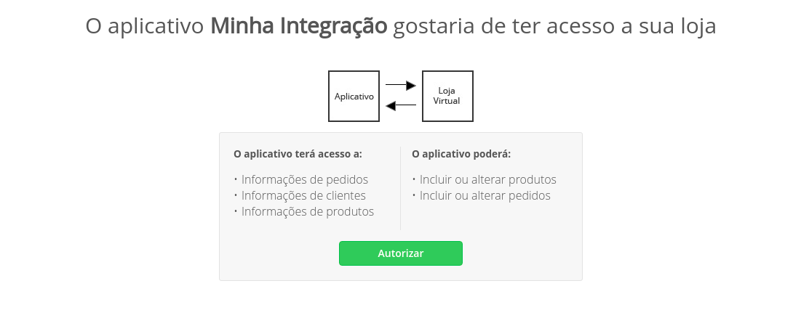

# Como Integrar

As APIs de Integração é um serviço formecido pela Tray para que nossos clientes possam integrar seus softwares a nossa plataforma.

## Ambiente de Teste

Não possuimos um ambiente especifico para teste, para esse fim, disponibilizamos uma loja compartilhada entre todos os integradores.

Para acessa-la [clique aqui](http://portaldeparceiros.tray.com.br/loja-de-testes).

## Nossas Integrações

A integração com a Tray é feita através das Nossas APIs no padrão REST, o que possibilita manipular os clientes, produtos e até os pedidos da loja virtual. Atualmente estão disponíveis as APIs:

- Autorização
- Características
- Carrinho de Compra
- Categorias
- Clientes
- Cupom
- Emissores de Etiquetas
- Etiqueta Mercado Livre
- informações Adicionais
- Informações da Loja
- Informações de Pagamentos
- Integração de Fretes
- Kits
- Lista de Preços B2B
- Marca de Produtos
- Newsletter
- Nota Fiscal
- Páginas da Loja
- Palavras-Chave
- Parceiros
- Pedidos
- Produtos
- Produtos Vendidos
- Scripts Externos
- Sistema de Notificação Webhook
- Status de Pedido
- Variação de Produtos

Para utilizar as APIs é necessário criar seu aplicativo e, após este cadastro, são liberadas as chaves para a integração.

Temos disponível para parceiros nossa Loja de Aplicativos, onde nossos lojistas conseguem localizar e fazer a instalação de forma simples e rápida e já integrar com a sua aplicação.

Desta forma, é possível integrar desde um sistema de gestão empresarial (ERP) ou sistemas próprios para melhorar a experiência do consumidor.

Também disponibilizamos a integração com o sistema de Gateway de Frete, caso precise personalizar o calculo de frete através de alguma transportadora.

## Criando seu Aplicativo

Para disponibilizar as chaves de integração é necessário realizar dois processos:

- Realizar o credenciamento
- Informar os dados para a criação de uma aplicação.

Para o credenciamento é necessário contato com nossa equipe de parcerias através do formulário de contato.

Segue abaixo link do formulário para contato:

[https://www.tray.com.br/parceiros/quero-ser-parceiro/](https://www.tray.com.br/parceiros/quero-ser-parceiro/)

Após o credenciamento, será necessário informar os dados do aplicativo para cadastro. Estes dados são divididos em dados do integrador, onde é necessário informar os dados da empresa que irá realizar a integração, e dados do aplicativo, com os dados para cadastro da aplicação. Segue abaixo os dados necessários:

### Dados do Aplicativo:

- Nome do aplicativo
- Descrição simplificada do aplicativo
- Imagem com o logo da aplicação
- Descrição completa do aplicativo
- URL de callback, em ambiente seguro - SSL (URL utilizada para realizar a autorização da aplicação)
- ID da Loja
- Link do vídeo (Youtube)
- URLs de imagens (máximo 3)

### Dados do integrador:

- Nome da empresa
- Telefone
- E-mail
- Site
- Nome do Responsável Técnico (Desenvolvedor)
- E-mail do Responsável Técnico (Desenvolvedor)

Após o cadastro da aplicação são disponibilizadas as chaves Consumer Key e Consumer Secret necessárias para a autorização do aplicativo e geração das chaves de acesso.

OBS: Todas as solicitações serão analisadas, onde poderão ser aprovadas ou rejeitadas devido solicitação indevida, ausência de informações ou solicitação de parceiro ou desenvolvedor não credenciado.

Quantidade de Requisições

As requisições tem um limite de envio, onde são diferenciadas de duas formas.

1 - Quantidade de requisições de curto espaço de tempo, limitado em 180 requisições por minuto.

2 - Quantidade de requisições diárias, limitado em 10 mil requisições diárias por loja, sendo um limite de 50 mil requisições por dia em caso de loja corporativa.

## Autorizando seu Aplicativo

A autenticação via oAuth 2.0 é necessário para acesso as informações da API e Aplicativos de Terceiro.

Abaixo a sequência de autenticação:

O código de autorização é fornecido através do servidor de autenticação do Tray.

Para permitir acesso as informações e recursos da conta, o cliente deve ser redirecionado para a url de autenticação pelo navegador.

O Tray Commerce é responsável por receber a confirmação da autorização do cliente e fornecer o código de autorização ao aplicativo.

### Url para autenticação:

`https://{dominio_da_loja}/auth.php`

Parâmetros HTTP "GET" suportados para a autenticação:

Parâmetro | Descrição  
------|------
response_type | Tipo de solicitação (Valor padrão **code**)
consumer_secret | Identificação do aplicativo junto ao Tray Commerce.
callback | URL de Callback que será redirecionado depois da autorização

Exemplo da url:

`https://{dominio_da_loja}/auth.php?response_type=code&consumer_key={consumer_key}&callback=https://{url_de_callback}`

Obs. trocar os dados que estão dentro de chaves { } para os dados da loja e do aplicativo.

### Fluxo de autorização

O aplicativo é acessado dentro da área administrativa da loja no menu Meus aplicativos. Após o acesso a este menu, terá disponível o botão Instalar novos aplicativos, onde os clientes poderão localizar a aplicação para instalação na loja.

Ao instalar uma aplicação, será realizado o redirecionamento para a URL de Callback informada no momento do cadastro do aplicativo, abrindo por exemplo a página `http://{dominiodoapp}/tray/callback` em um iframe, dentro da área administrativa da loja.

Neste ponto a platforma irá enviar os seguintes parâmetros pela url:

`array(3) {
  ["url"]=>
  string(42) "https://trayparceiros.commercesuite.com.br"
  ["adm_user"]=>
  string(8) "roottray"
  ["store"]=>
  string(6) "391250"
}`

Você deverá implementar nesta URL `http://{dominiodoapp}/tray/callback`, uma Landing Page apresentando os detalhes do aplicativo e disponibilizar um botão para o cliente solicitando a integração com a aplicação. Geralmente este botão tem o titulo de Instale agora ou Inicie agora.

Neste botão você irá direcionar o cliente para a URL de autorização da loja, onde esta URL ficaria:

`http://{URL da loja}/auth.php?response_type=code&consumer_key=**CONSUMER_KEY**&callback=http://{dominiodoapp}/tray/callback/auth/`

Quando direcionado o cliente para essa pagina, irá aparecer uma tela solicitando a autorização da aplicação, conforme abaixo:

Uma observação importante é que, após autorizado, não será mais exibida essa tela, já passando automaticamente para o fluxo abaixo.

Neste ponto a plataforma irá enviar os seguintes parâmetros na url:

`array(5) {
  ["adm_user"]=>
  string(8) "roottray"
  ["code"]=>
  string(64) "48f72c09305060f12b894193aaba2962989f00637012b8fa92b9d657e5a297f7"
  ["api_address"]=>
  string(50) "https://trayparceiros.commercesuite.com.br/web_api"
  ["store"]=>
  string(6) "391250"
  ["store_host"]=>
  string(42) "https://trayparceiros.commercesuite.com.br"
}`

Após a autorização, o cliente é redirecionado para URL informada no parâmetro callback passado no momento da autorização (no exemplo acima é a URL `http://{dominiodoapp}/tray/callback/auth/`), onde ficará da seguinte forma esta URL:

`http://{dominiodoapp}/tray/callback/auth/?code=2132112312321313abc123edf&store=391250&api_address=http://{URL da loja}/web_api/`

Neste processo deve-se capturar as informações dessa URL e utilizá-las para configurar em sua aplicação, sendo os parâmetros code e api_address mais importantes no processo de integração.

Com o **code** e **api_address** é possível utilizar a [API de Gerar Chave de Acesso](#gerar-chaves-de-acesso-post), para gerar o **access_token** utilizados nas outras APIs. É de extrema importância armazenar todas as informações de retorno desta API, pois serão utilizados constantemente durante a comunicação com a Tray.

Pode-se notar que no retorno da [API de Gerar Chave de Acesso](#gerar-chaves-de-acesso-post) existe a expiração dessas chaves e, quando expirado, deverá utilizar a [API de Atualizar Chave de Acesso](#atualizar-chave-de-acesso-get), onde será gerada um novo **access_token** para continuar realizando requisições nas APIs.

Dessa forma, toda referência que encontrar na documentação de **api_address** deverá ser utilizada a URL retornada no momento da autorização da API, conforme informado acima, e utilizar o **access_token** gerado para não ocorrer problema de permissão de acesso aos dados.

## Dúvidas e Suporte

Para dúvidas relacionadas ao consumo das APIs disponibilizadas pedimos que abra um chamado diretamente através da nossa [central de atendimento](https://atendimento.tray.com.br/hc/pt-br/requests/new).